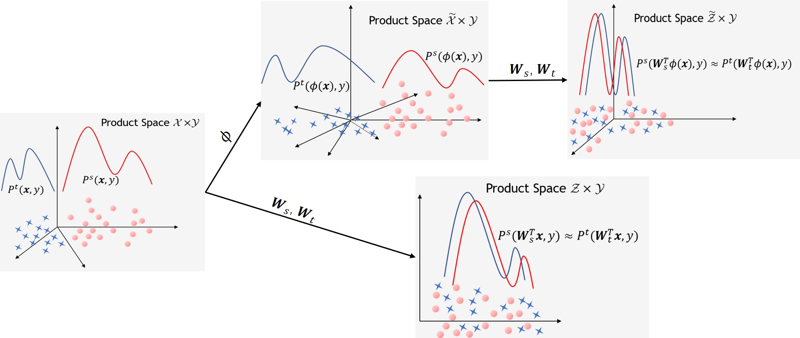

# Joint Distribution Invariant Projections (JDIP)

This repository provides a python3 implementation of the domain adaptation approach JDIP. The implementation relies on the pymanopt toolbox available at https://www.pymanopt.org/. The jupyter notebook demo.ipynb shows how to run this method in a semi-supervised domain adaptation setting.

Briefly speaking, the goal of JDIP is to solve the joint distribution mismatch problem in domain adaptation. To this end, it exploits a couple of points on the Stiefel manifold to match the source and target joint distributions under the $L^{2}$-distance. The following figure illustrates this joint distribution matching idea.   

For more details of this domain adaptation approach,  please refer to our IEEE TIP work: 

@article{Chen2020Domain,  
  author={Chen, Sentao and Harandi, Mehrtash and Jin, Xiaona and Yang, Xiaowei},  
  journal={IEEE Transactions on Image Processing},   
  title={Domain Adaptation by Joint Distribution Invariant Projections},   
  year={2020},  
  volume={29},  
  number={},  
  pages={8264-8277},  
  doi={10.1109/TIP.2020.3013167}  
  }

